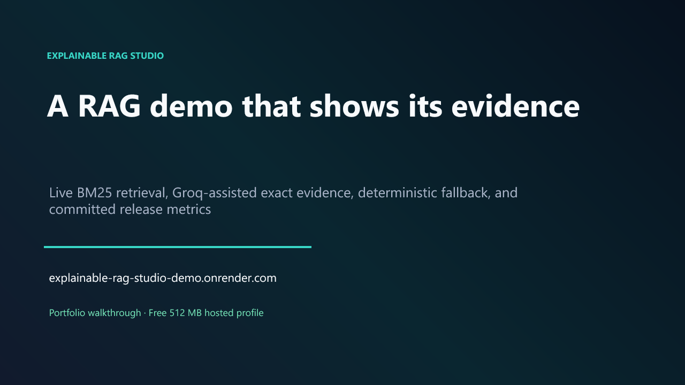
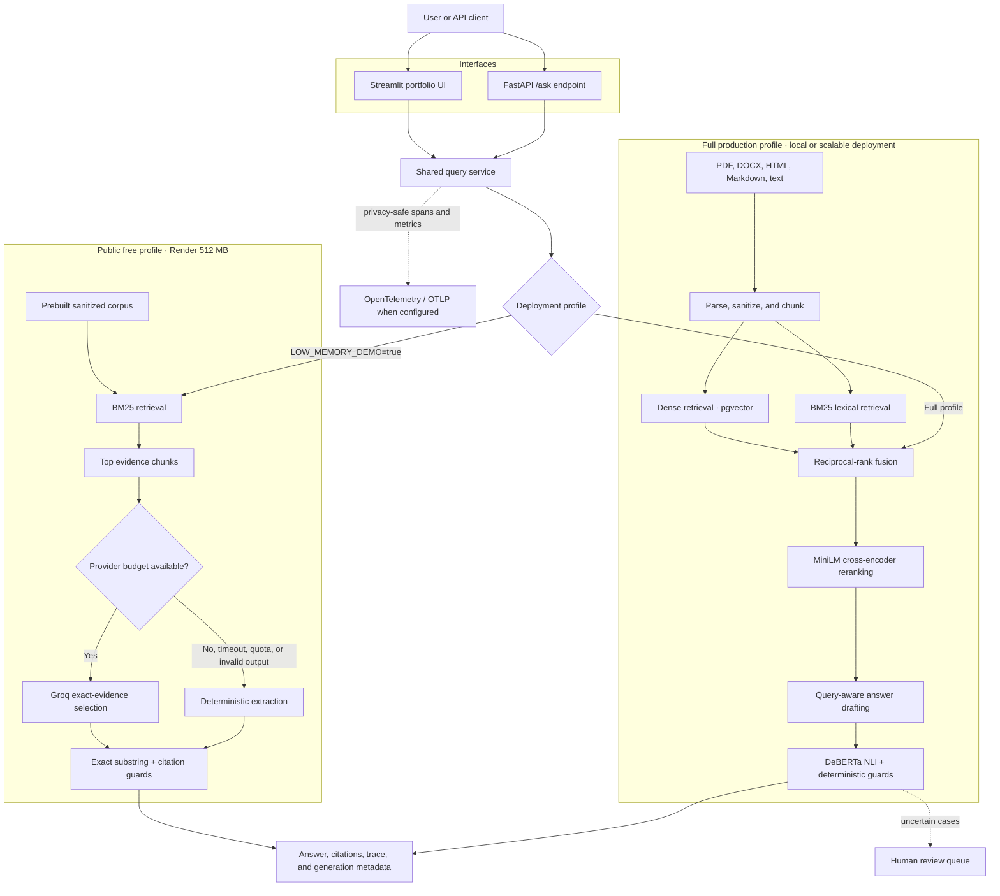
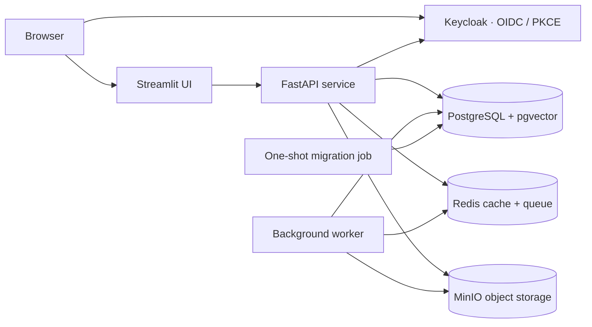

# Explainable RAG Studio

**An evidence-first RAG reliability workbench that makes retrieval, citations, grounding decisions, and fallbacks visible.**

[](https://explainable-rag-studio-demo.onrender.com/)
[](https://github.com/HarshTikone/explainable-rag-studio/actions/workflows/quality.yml)
[](https://github.com/HarshTikone/explainable-rag-studio/actions/workflows/release-quality.yml)
[](https://github.com/HarshTikone/explainable-rag-studio/actions/workflows/security.yml)
[](https://www.python.org/)
[](https://fastapi.tiangolo.com/)
[](https://streamlit.io/)

[Live demo](https://explainable-rag-studio-demo.onrender.com/) · [Watch the walkthrough](docs/assets/explainable-rag-studio-demo.mp4) · [Architecture](docs/ARCHITECTURE.md) · [Release evidence](docs/QUALITY_GATE_RELEASE.md) · [Deployment guide](docs/DEPLOYMENT_RUNBOOK.md)

> The hosted demo runs on Render's free 512 MB service. A cold start can take about a minute. The app then stays lightweight by using BM25 retrieval and exact-evidence generation with a deterministic fallback.

## Watch the 4-minute walkthrough

[](docs/assets/explainable-rag-studio-demo.mp4)

**Click the image to play the narrated demo.** A matching [subtitle file](docs/assets/explainable-rag-studio-demo.srt) is also included.

## Why this project exists

A conventional RAG demo returns an answer. Explainable RAG Studio also shows **why that answer should be trusted**—or why the system refused to answer.

| Reliability problem | What the studio does |
| --- | --- |
| A fluent answer can still be unsupported | Verifies each claim against cited evidence and exposes the decision path |
| Retrieval quality is difficult to inspect | Shows ranked chunks, scores, strategy, source metadata, and timing |
| Provider outages and quotas break demos | Falls back to deterministic extraction instead of failing the query |
| Numbers and identifiers are easy to distort | Applies exact-text, number, identifier, negation, and contradiction guards |
| Quality claims are often anecdotal | Ships a frozen 112-question benchmark and committed promotion artifact |
| A full RAG stack is too heavy for a free host | Uses a separate low-memory public profile while preserving the full platform locally |

## What you can try

The public app intentionally has four focused pages backed by a **60-document sanitized demo corpus**:

1. **Home** — project framing, hosted-profile limits, and sample prompts.
2. **What is RAG** — an approachable explanation of retrieval, generation, citations, and verification.
3. **Ask & Explain** — the complete query trace: answer, evidence, scores, timings, generation mode, and grounding status.
4. **Results** — the committed release decision, benchmark composition, measured metrics, and known limitations.

Try these questions in the [live demo](https://explainable-rag-studio-demo.onrender.com/):

- `How long are audit logs retained?`
- `What is the Meridian incident identifier?`
- `Compare the 400-day audit retention period with the 90-day temporary artifact period.`
- `What is the manufacturing cost of the platform?` — this should abstain because the corpus does not contain the answer.

## Architecture

The same query contract supports two deliberately different deployment profiles. The public profile is optimized for a free 512 MB host; the full profile demonstrates the production retrieval and verification stack.



### Full deployment topology



See [docs/ARCHITECTURE.md](docs/ARCHITECTURE.md) for trust boundaries, ingestion, retrieval, grounding, identity, observability, and failure-mode diagrams.

## Two profiles, one reliability contract

| Capability | Public hosted profile | Full profile |
| --- | --- | --- |
| Primary goal | Fast, safe portfolio demo on free infrastructure | Production-style RAG platform demonstration |
| Retrieval | BM25 | Dense + BM25 + reciprocal-rank fusion |
| Reranking | Disabled to protect memory | MiniLM cross-encoder |
| Generation | Groq selects up to two exact evidence sentences | Query-aware drafting with configurable providers |
| Provider failure | Deterministic extraction; query still completes | Configurable fallback and verification policy |
| Grounding | Exact-substring and citation guards | DeBERTa NLI, premise windows, semantic support, and deterministic guards |
| Storage | Prebuilt read-only public corpus | PostgreSQL/pgvector, Redis, and MinIO |
| Identity | Public read-only experience | Keycloak OIDC with RBAC |
| Admin and uploads | Not exposed | Authenticated workspaces |

## Measured release evidence

The project does not promote a quality policy from a single happy-path query. Its frozen evaluation set contains **112 questions**, including **25 unanswerable questions (22.3%)**, plus contradiction, hard-negative, identifier, and retention cases.

The committed release artifact reports:

| Gate | Result | Release requirement |
| --- | ---: | ---: |
| Retrieval MRR | **0.952** | ≥ 0.85 |
| Retrieval nDCG@5 | **0.950** | ≥ 0.85 |
| Grounding macro F1 | **0.901** | ≥ 0.85 |
| Supported precision | **1.000** | ≥ 0.95 |
| Contradiction recall | **1.000** | ≥ 0.85 |
| Citation validity | **100%** | 100% |
| Unsupported claims exposed | **0** | 0 |
| Verification p95 | **400 ms** | < 1.5 s |
| Answer-accuracy delta | **0.000** | ≥ -0.02 |
| Abstention delta | **0.000** | ≥ -0.01 |

The promoted full-profile retrieval strategy remains `hybrid_rerank`. The hosted free profile intentionally uses BM25, so these full-profile benchmark numbers are presented as release evidence—not as a claim that the free profile runs the same models.

Source: [docs/benchmarks/quality-gate-reference.json](docs/benchmarks/quality-gate-reference.json). Methodology and decisions: [docs/QUALITY_GATE_RELEASE.md](docs/QUALITY_GATE_RELEASE.md).

## Reliability and safety controls

- **Shared query service:** Streamlit and FastAPI use the same retrieval, generation, verification, telemetry, and fallback policy.
- **Bounded public inputs:** questions are capped at 500 characters, retrieval at six chunks, and provider context at 12,000 characters.
- **Exact-evidence generation:** every provider-selected claim must be an exact normalized substring of its cited chunk.
- **Fail-closed validation:** one invalid claim rejects the complete provider draft and activates the local extractor.
- **Quota-aware degradation:** global, per-session, daily, and concurrency budgets prevent accidental provider exhaustion.
- **Circuit breaker:** quota and provider failures temporarily bypass external generation while retrieval remains available.
- **Prompt-injection defense:** ingestion sanitization and suspicious-content metadata keep document instructions outside the control plane.
- **Grounded abstention:** missing or conflicting evidence produces an explicit refusal instead of an invented answer.
- **Privacy-safe telemetry:** spans never attach raw questions, prompts, evidence, API keys, or user identifiers.
- **Secure full profile:** OIDC/PKCE, RBAC, CSRF defenses, tenant scoping, security headers, audit events, and encrypted integration secrets.

## Observability and cost awareness

OpenTelemetry spans cover parsing, chunking, embedding, retrieval, fusion, reranking, generation, verification, and complete queries. Export occurs only when an OTLP endpoint is configured; the public Render service has no telemetry egress by default.

Generation metadata includes provider, model, fallback reason, and input/output/cached/total tokens. Context-cache, embedding-cache, and verifier-token-cache hits are tracked separately. Cost rates are configuration-driven; the free public profile displays a zero-dollar estimate instead of hardcoding vendor prices.

## Technology stack

| Layer | Technology |
| --- | --- |
| UI and API | Streamlit, FastAPI, Pydantic |
| Retrieval | BM25, sentence-transformer embeddings, pgvector, reciprocal-rank fusion |
| Reranking | MiniLM cross-encoder |
| Grounding | `cross-encoder/nli-deberta-v3-xsmall`, lexical/identifier/number guards |
| Public generation | Groq `openai/gpt-oss-20b` with deterministic extraction fallback |
| Data services | PostgreSQL, Redis, MinIO |
| Identity and security | Keycloak, OAuth 2.0 / OIDC, PKCE, RBAC |
| Observability | OpenTelemetry, structured metrics, configurable OTLP export |
| Delivery | Docker, Docker Compose, GitHub Actions, Render Blueprint |

## Run the public profile locally

### 1. Create the environment

```powershell
py -3.11 -m venv .venv
.venv\Scripts\Activate.ps1
pip install -r requirements-public.txt
```

### 2. Configure the lightweight profile

```powershell
$env:LOW_MEMORY_DEMO = "true"
$env:SECURITY_MODE = "demo"
$env:PUBLIC_GENERATION_ENABLED = "true"
$env:GROQ_API_KEY = "optional"
```

`GROQ_API_KEY` is optional. Without it, the same query path uses deterministic exact extraction and clearly labels the fallback in the UI.

### 3. Build the demo index and start the app

```powershell
python scripts/build_demo_index.py
streamlit run app/Home.py
```

Open `http://localhost:8501`.

### Docker equivalent

```powershell
docker build --build-arg LOW_MEMORY_DEMO=true --build-arg BUILD_DEMO_INDEX=true -t explainable-rag-studio .
docker run --rm -p 8501:8501 -e LOW_MEMORY_DEMO=true -e SECURITY_MODE=demo explainable-rag-studio
```

## Run the full profile

The full stack adds PostgreSQL/pgvector, Redis, MinIO, Keycloak, the API, worker, and authenticated workspaces.

```powershell
Copy-Item .env.example .env
docker compose up -d --build
```

Then open:

- Streamlit: `http://localhost:8501`
- FastAPI docs: `http://localhost:8000/docs`
- Keycloak: `http://localhost:8080`
- MinIO console: `http://localhost:9001`

For hardened configuration and rollout steps, use [docs/PRODUCTION_PLATFORM.md](docs/PRODUCTION_PLATFORM.md) and [docs/DEPLOYMENT_RUNBOOK.md](docs/DEPLOYMENT_RUNBOOK.md).

## Test and validate

```powershell
pytest -q
python scripts/validate_docs.py
python scripts/validate_public_release.py
python scripts/run_quality_gate.py
```

Pull requests to `main` run the Python 3.11 suite, security checks, public UI tests, a real `/ask` smoke test, Docker validation, and retained release-quality checks.

## Repository map

```text
app/                    Streamlit application and public router
src/rag_studio/         Retrieval, generation, grounding, security, and API services
tests/                  Unit, integration, UI, security, and release tests
scripts/                Indexing, validation, evaluation, and deployment utilities
docs/                   Architecture, benchmarks, release evidence, and runbooks
deploy/                 Identity and deployment configuration
render.yaml             Free-profile Render Blueprint
docker-compose.yml      Full local platform
```

## Known limitations

- Render's free service can cold-start and has a strict memory ceiling.
- The public corpus is intentionally small, sanitized, and read-only.
- Groq is optional and rate-limited; quota exhaustion is an expected fallback condition, not an outage.
- Exact-evidence generation favors faithfulness over conversational rewriting.
- The full hybrid/reranked profile requires more memory and infrastructure than the public demo.
- Evaluation results describe the committed benchmark and configuration; they are not a universal guarantee for arbitrary corpora.

## Documentation

- [Architecture](docs/ARCHITECTURE.md)
- [Claim-level grounding](docs/CLAIM_LEVEL_GROUNDING.md)
- [Context-aware ingestion](docs/CONTEXT_AWARE_INGESTION.md)
- [Quality-gate release](docs/QUALITY_GATE_RELEASE.md)
- [Release closure](docs/RELEASE_CLOSURE.md)
- [Reranking benchmark](docs/RERANKING_BENCHMARK.md)
- [Production platform](docs/PRODUCTION_PLATFORM.md)
- [Threat model](docs/THREAT_MODEL.md)
- [Deployment runbook](docs/DEPLOYMENT_RUNBOOK.md)

---

Built to demonstrate that a RAG system can be useful **and** inspectable: retrieve the evidence, verify the claims, expose the reasoning path, and degrade safely when a provider is unavailable.
