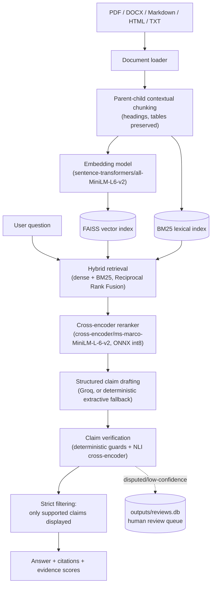
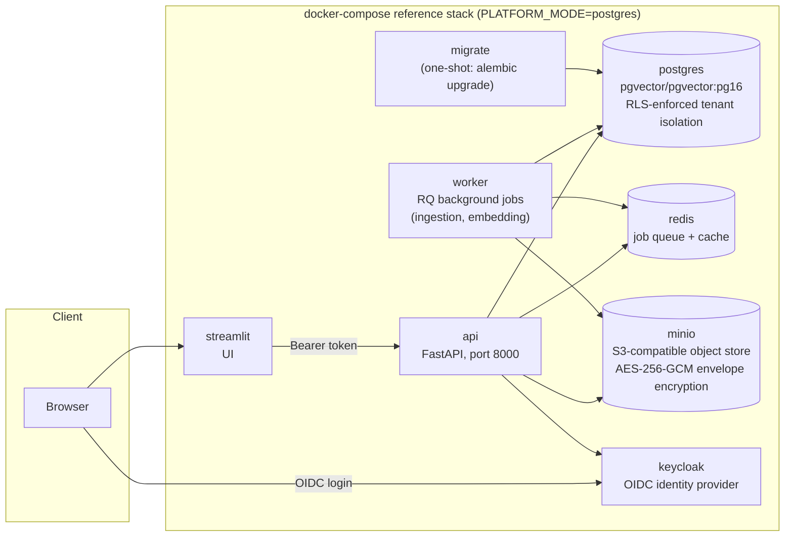

# Architecture

This document covers two layers: the **claim-level RAG pipeline** (how a question becomes a
cited, verified answer) and the **production platform topology** (how that pipeline is deployed
as a multi-tenant service with its own storage, auth, and secrets). Both are the real, committed
configuration in this repository (`docker-compose.yml`, `backend/`, `deploy/`) — nothing here is
aspirational.

## RAG pipeline

The full-profile reranker uses corpus lifecycle metadata as a deterministic final guard: evidence
explicitly marked obsolete/legacy stays behind active evidence unless the question asks for
historical or incident information. This prevents a cross-encoder from preferring a stale passage
merely because a contrastive question quotes both the old and current values.

Verification (`backend/grounding.py`) runs two layers per claim, not one:

1. **Deterministic guards** — regex/word-list checks for missing identifiers, numeric conflicts,
   negation mismatches, and antonym state pairs between the claim and its cited evidence. Any
   guard in `HARD_CONFLICT_REASONS` short-circuits straight to a `contradicted` verdict,
   independent of the model.
2. **NLI cross-encoder** (`cross-encoder/nli-deberta-v3-xsmall`, pinned revision, CPU/ONNX) —
   scores entailment/contradiction/neutral against three bounded premises: the best atomic
   sentence, its adjacent two-sentence window, and the bounded full chunk. Maximum entailment and
   contradiction are aggregated independently. Calibrated identifier/number anchors and embedding
   similarity can support a claim only when no hard conflict exists.

Both calibration (which policy thresholds to lock) and promotion (does the locked policy clear
the bar) run against a frozen, split benchmark (`data/grounding_benchmark.json`): 48 calibration
cases the policy is allowed to be tuned against, and 48 held-out cases that are only ever
evaluated once, after the policy is locked — see `docs/QUALITY_GATE_RELEASE.md` for the full
promotion-gate rules.

## Production platform topology

Every service starts from the same `Dockerfile` image; `deploy/start-service.sh` dispatches on
its first argument (`migrate` / `api` / `streamlit` / `worker`) and, in postgres mode, sources
`deploy/env-secrets.sh` to resolve Docker secret files (`/run/secrets/*`) into the env vars
`backend/config.py` reads. The default `PLATFORM_MODE=legacy` profile (a bare `pip install` run,
no compose stack) skips all of that and runs on local FAISS + SQLite — the two profiles share
application code, not infrastructure.

## Hosted public profile

The Render service is a separate constrained profile, not a smaller claim about the full stack:

- `LOW_MEMORY_DEMO=true` forces BM25 and rejects dense/hybrid API requests with `422`.
- No embedding, reranking, or NLI model is instantiated or downloaded.
- Groq `openai/gpt-oss-20b` may make one 12-second call to select at most two exact cited evidence
  sentences. Every returned claim must be an exact normalized substring of its cited chunk.
- Global/session minute and daily allowances, single-call concurrency, and a five-minute circuit
  breaker protect the Free-tier budget. Every failure continues through deterministic extraction.
- Only Home, What is RAG, Ask & Explain, and Results are registered in public navigation; uploads
  and authenticated workspaces stay in the full profile.

Both Streamlit and FastAPI call `backend/query_service.py`, so retrieval policy, generation,
verification, fallback behavior, privacy-safe metrics, and limits cannot drift between surfaces.

## Observability boundary

OpenTelemetry spans cover parsing, chunking, embedding, retrieval, fusion, reranking, external
generation, verification, and complete queries. Export is inert unless
`OTEL_EXPORTER_OTLP_ENDPOINT` is configured. Spans never contain raw queries, prompts, evidence,
keys, or user identifiers. Local metrics retain query hashes/lengths, model and fallback state,
Provider token usage and configurable cost estimates, plus aggregate context/embedding/verifier
cache hits and misses.

Security posture, concretely:

- **Tenant isolation**: Postgres roles are split — `rag_app` (the app's normal runtime identity)
  is `NOBYPASSRLS` under `FORCE ROW LEVEL SECURITY`, so every query is tenant-scoped at the
  database layer, not just in application code. `rag_owner` (superuser) is only ever used for
  `pg_dump`/`pg_restore` from inside the `api` container, never for request handling.
  (`backend/database.py`, `backend/platform_operations.py`)
- **Object storage**: uploaded documents are client-side envelope-encrypted
  (AES-256-GCM, per-object data key wrapped by a master key) before they reach MinIO — the
  object store never sees plaintext, and MinIO's own SSE is deliberately not used (no KMS
  configured for it). (`backend/object_store.py`)
- **Auth**: OIDC via Keycloak for interactive sessions, plus a separate API-key path
  (`backend/security.py`) with a server-side pepper, for programmatic/API access.
- **Audit trail**: every mutating action is HMAC-chained (`AUDIT_HMAC_KEY`) so tampering with
  the audit log is detectable, not just logged. Verified end-to-end in CI via `/audit/verify`.
- **Secrets**: never baked into the image or committed — generated per-environment
  (`scripts/generate_dev_secrets.py`) and mounted as Compose file-based secrets, one file per
  credential, readable only by the services that need them (the `postgres_password` superuser
  credential, for example, is mounted only into the `api` container, not `streamlit` or `worker`).

## Where this is validated

`​.github/workflows/release-quality.yml` builds and runs the full compose stack above on a real
GitHub Actions runner (this sandbox's own network access is policy-restricted, so this is the
only place these claims are checked against reality) — dependency/static security scans, the
complete pytest suite with coverage gates, real-model smoke tests, an end-to-end API smoke test
against the live stack, a real backup/restore cycle, and the retrieval/grounding/runtime/security
promotion gates from `docs/QUALITY_GATE_RELEASE.md`. Current gate status is tracked in
`docs/benchmarks/quality-gate-reference.json` (also printed into each run's job summary) and
summarized in `docs/ADVANCED_BUILD_PLAN.md`'s Milestone 6.5 section — treat that file, not this
one, as the source of truth for which gates are currently promoted.
